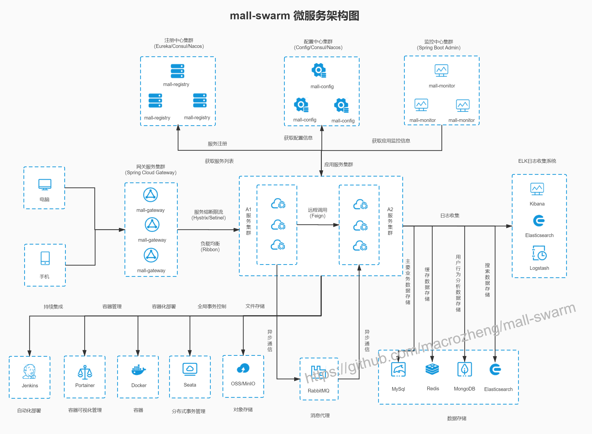
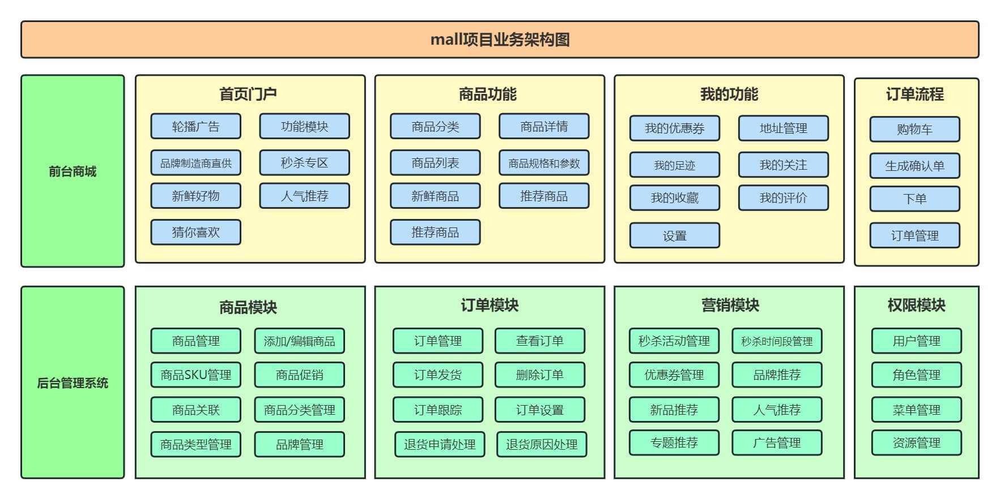
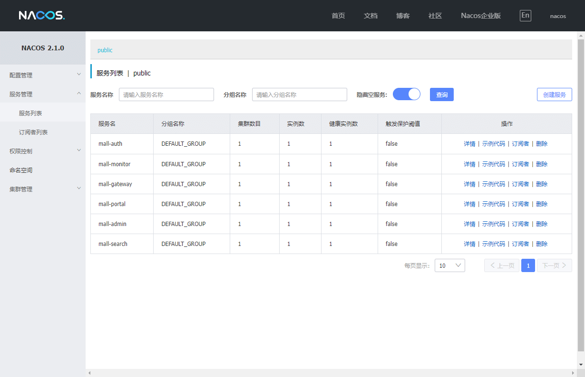
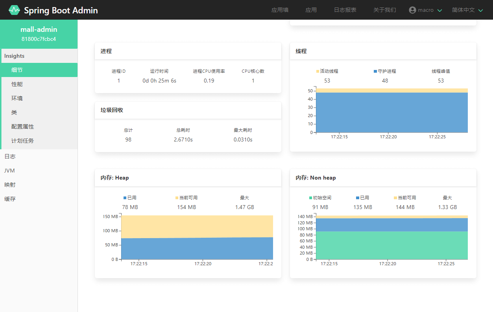
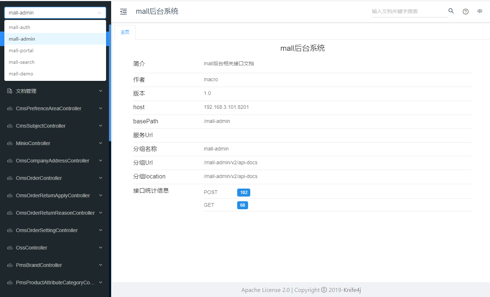
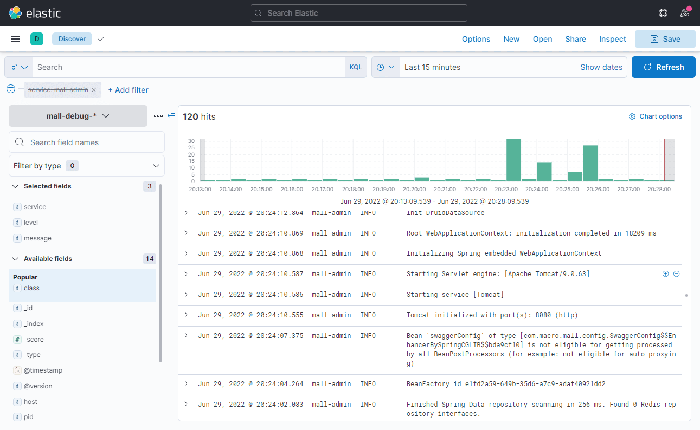

## 项目简介

`mall`是一套微服务商城系统，基于SpringCloud+Vue+uni-app实现，包括前台商城系统及后台管理系统。

前台商城系统包含首页门户、商品推荐、商品搜索、商品展示、购物车、订单流程、会员中心、客户服务等模块。

后台管理系统包含商品管理、订单管理、会员管理、促销管理、运营管理、内容管理、统计报表、财务管理、权限管理等模块。

## 项目结构

``` lua
mall -- 项目
├── mall  -- 后端模块
├── mall-app-web  -- 前台商城页面
├── mall-admin-web -- 后台管理页面
```

## mall

### 简介

`mall`是一套微服务商城系统，采用了 Spring Cloud 2021 & Alibaba、Spring Boot 2.
7、Oauth2、MyBatis、Elasticsearch、Docker、Kubernetes等核心技术，同时提供了基于Vue的管理后台方便快速搭建系统。`mall
`在电商业务的基础集成了注册中心、配置中心、监控中心、网关等系统功能。

### 项目架构

#### 系统架构



#### 业务架构



#### 组织结构

``` lua
mall
├── mall-common -- 工具类及通用代码模块
├── mall-mbg -- MyBatisGenerator生成的数据库操作代码模块
├── mall-auth -- 基于Spring Security Oauth2的统一的认证中心
├── mall-gateway -- 基于Spring Cloud Gateway的微服务API网关服务
├── mall-monitor -- 基于Spring Boot Admin的微服务监控中心
├── mall-admin -- 后台管理系统服务
├── mall-search -- 基于Elasticsearch的商品搜索系统服务
├── mall-portal -- 移动端商城系统服务
├── mall-demo -- 微服务远程调用测试服务
└── config -- 配置中心存储的配置
```

#### 开发环境

| 工具            | 版本号    | 下载                                                                                   |
|---------------|--------|--------------------------------------------------------------------------------------|
| JDK           | 1.8    | https://www.oracle.com/technetwork/java/javase/downloads/jdk8-downloads-2133151.html |
| Mysql         | 5.7    | https://www.mysql.com/                                                               |
| Redis         | 7.0    | https://redis.io/download                                                            |
| Elasticsearch | 7.17.3 | https://www.elastic.co/cn/downloads/elasticsearch                                    |
| Kibana        | 7.17.3 | https://www.elastic.co/cn/downloads/kibana                                           |
| Logstash      | 7.17.3 | https://www.elastic.co/cn/downloads/logstash                                         |
| MongoDb       | 5.0    | https://www.mongodb.com/download-center                                              |
| RabbitMq      | 3.10.5 | http://www.rabbitmq.com/download.html                                                |
| nginx         | 1.22   | http://nginx.org/en/download.html                                                    |

### 运行效果展示

- 查看注册中心注册服务信息，访问地址：http://192.168.10.100:8848/nacos/



- 监控中心应用信息，访问地址：http://192.168.10.100:8101




- API文档信息，访问地址：http://192.168.10.100:8201



- 日志收集系统信息，访问地址：http://192.168.10.100:5601



- 可视化容器管理，访问地址：http://192.168.10.100:9000


## mall-app-web

### 前言

该项目为前后端分离项目的前端部分

### 介绍

`mall-app-web`是一个电商系统的移动端项目，基于`uni-app`实现。主要包括首页门户、商品推荐、商品搜索、商品展示、购物车、订单流程、会员中心、客户服务、帮助中心等功能。

#### 效果展示


#### 项目结构

``` lua
src -- 源码目录
├── api -- luch-request网络请求定义
├── components -- 通用组件封装
├── js_sdk -- 第三方sdk源码
├── static -- 图片等静态资源
├── store -- vuex的状态管理
├── utils -- 工具类
└── pages -- 前端页面
    ├── address -- 地址管理页
    ├── brand -- 商品品牌页
    ├── cart -- 购物车页
    ├── category -- 商品分类页
    ├── coupon -- 优惠券页
    ├── index -- 首页
    ├── money -- 支付页
    ├── notice -- 通知页
    ├── order -- 订单页
    ├── product -- 商品页
    ├── public -- 登录页
    ├── set -- 设置页
    ├── user -- 会员页
    └── userinfo -- 会员信息页
```

### 搭建步骤

- 本项目使用了`uni-app`专用开发工具`HBuilder X`（App开发版）开发，下载地址：https://www.dcloud.io/hbuilderx.html
- 该项目为前后端分离项目，访问本地访问接口需搭建后台环境
- 注意由于`mall-app-web`中的接口都在`mall-portal`模块中，所以一定要启动该模块；
- 访问在线接口无需搭建后台环境，只需将`utils/requestUtil.js`文件中的`config.baseUrl`
  改为线上地址即可：https://portal-api.macrozheng.com
- 克隆源代码到本地，使用`HBuilder X`打开；
- 在`HBuilder X`中使用`运行->运行到浏览器->Chrome`
  运行项目，运行成功后会自动打开下面地址（将浏览器改为手机模式）：http://localhost:8080
- 如果浏览器没有启动的话，可以直接访问如下地址访问：http://localhost:8080


## mall-admin-web

### 前言

该项目为前后端分离项目的前端部分

### 介绍

`mall-admin-web`是一个电商后台管理系统的前端项目，基于Vue+Element实现。主要包括商品管理、订单管理、会员管理、促销管理、运营管理、内容管理、统计报表、财务管理、权限管理、设置等功能。

#### 效果展示


#### 项目布局

``` lua
src -- 源码目录
├── api -- axios网络请求定义
├── assets -- 静态图片资源文件
├── components -- 通用组件封装
├── icons -- svg矢量图片文件
├── router -- vue-router路由配置
├── store -- vuex的状态管理
├── styles -- 全局css样式
├── utils -- 工具类
└── views -- 前端页面
    ├── home -- 首页
    ├── layout -- 通用页面加载框架
    ├── login -- 登录页
    ├── oms -- 订单模块页面
    ├── pms -- 商品模块页面
    └── sms -- 营销模块页面
```

### 搭建步骤

下载node并安装：[https://nodejs.org/dist/v12.14.0/node-v12.14.0-x64.msi](https://nodejs.org/dist/v12.14.0/node-v12.14.0-x64.msi);

- 该项目为前后端分离项目，访问本地访问接口需搭建后台环境;
- 如果你对接的是 微服务后台的话，所有接口都需要通过网关访问，需要将`config/dev.env.js`文件中的`BASE_API`
  改为[http://localhost:8201/mall-admin](http://localhost:8201/mall-admin) ；
- 克隆源代码到本地，使用IDEA打开，并完成编译;
- 在IDEA命令行中运行命令：`npm install`,下载相关依赖;
- 在IDEA命令行中运行命令：`npm run dev`,运行项目;
- 访问地址：[http://localhost:8090](http://localhost:8090) 即可打开后台管理系统页面;


## 技术选型

### 后端技术

| 技术                   | 说明                 | 官网                                                 |
| ---------------------- | -------------------- | ---------------------------------------------------- |
| Spring Cloud           | 微服务框架           | https://spring.io/projects/spring-cloud              |
| Spring Cloud Alibaba   | 微服务框架           | https://github.com/alibaba/spring-cloud-alibaba      |
| Spring Boot            | 容器+MVC框架         | https://spring.io/projects/spring-boot               |
| Spring Security Oauth2 | 认证和授权框架       | https://spring.io/projects/spring-security-oauth     |
| MyBatis                | ORM框架              | http://www.mybatis.org/mybatis-3/zh/index.html       |
| MyBatisGenerator       | 数据层代码生成       | http://www.mybatis.org/generator/index.html          |
| PageHelper             | MyBatis物理分页插件  | http://git.oschina.net/free/Mybatis_PageHelper       |
| Knife4j                | 文档生产工具         | https://github.com/xiaoymin/swagger-bootstrap-ui     |
| Elasticsearch          | 搜索引擎             | https://github.com/elastic/elasticsearch             |
| RabbitMq               | 消息队列             | https://www.rabbitmq.com/                            |
| Redis                  | 分布式缓存           | https://redis.io/                                    |
| MongoDb                | NoSql数据库          | https://www.mongodb.com/                             |
| Docker                 | 应用容器引擎         | https://www.docker.com/                              |
| Druid                  | 数据库连接池         | https://github.com/alibaba/druid                     |
| OSS                    | 对象存储             | https://github.com/aliyun/aliyun-oss-java-sdk        |
| MinIO                  | 对象存储             | https://github.com/minio/minio                       |
| JWT                    | JWT登录支持          | https://github.com/jwtk/jjwt                         |
| LogStash               | 日志收集             | https://github.com/logstash/logstash-logback-encoder |
| Lombok                 | 简化对象封装工具     | https://github.com/rzwitserloot/lombok               |
| Seata                  | 全局事务管理框架     | https://github.com/seata/seata                       |
| Portainer              | 可视化Docker容器管理 | https://github.com/portainer/portainer               |
| Jenkins                | 自动化部署工具       | https://github.com/jenkinsci/jenkins                 |
| Kubernetes             | 应用容器管理平台     | https://kubernetes.io/                               |

### 前端技术

| 技术       | 说明                  | 官网                           |
| ---------- | --------------------- | ------------------------------ |
| Vue        | 前端框架              | https://vuejs.org/             |
| Vue-router | 路由框架              | https://router.vuejs.org/      |
| Vuex       | 全局状态管理框架      | https://vuex.vuejs.org/        |
| Element    | 前端UI框架            | https://element.eleme.io/      |
| Axios      | 前端HTTP框架          | https://github.com/axios/axios |
| v-charts   | 基于Echarts的图表框架 | https://v-charts.js.org/       |

### 移动端技术

| 技术         | 说明             | 官网                                    |
| ------------ | ---------------- | --------------------------------------- |
| Vue          | 核心前端框架     | https://vuejs.org                       |
| Vuex         | 全局状态管理框架 | https://vuex.vuejs.org                  |
| uni-app      | 移动端前端框架   | https://uniapp.dcloud.io                |
| mix-mall     | 电商项目模板     | https://ext.dcloud.net.cn/plugin?id=200 |
| luch-request | HTTP请求框架     | https://github.com/lei-mu/luch-request  |

## 学习记录

### 后端

- Day1
  1. 理解项目整体架构和资料
- Day2
  1. mybatis-generator配置与使用，并加入swagger注解
  2. 后台理解权限模块逻辑，admin模块搭建
  3. gateway网关搭建
  4. knife4j接口文档配置与使用
  5. 通用工具类部分理解
- Day3
  1. 权限框架的初步搭建
  2. swagger配置代码理解
  3. swagger2注释理解
- Day4
  1. 理解auth模块(未debug)
  2. 大致理解gateway模块(鉴权未完全理解)
  3. Spring Boot Admin学习, monitor模块完成
  4. Elastic Stack 搭建日志收集系统(未完成)
- Day5
  1. Elastic Stack 搭建日志收集系统已完成
- Day6
  1. 

#### 学习进度

1. admin
2. auth
3. common
4. demo
5. gateway
6. mbg √
7. monitor √
8. portal
9. search

### 前端

待学习