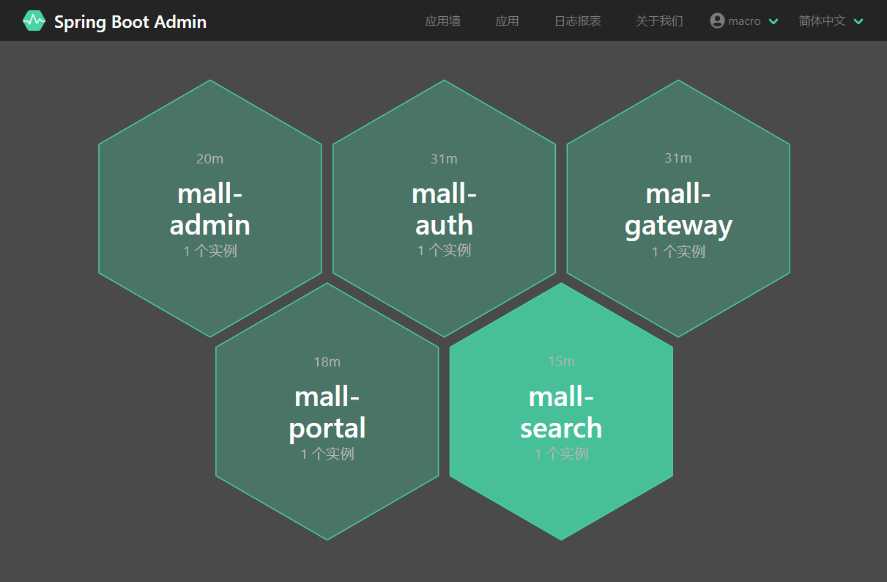
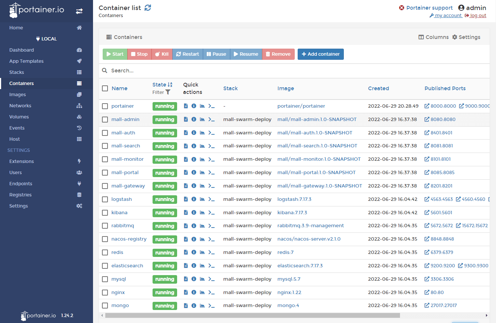

## 项目简介

`mall`是一套微服务商城系统，采用了 Spring Cloud 2021 & Alibaba、Spring Boot 2.
7、Oauth2、MyBatis、Elasticsearch、Docker、Kubernetes等核心技术，同时提供了基于Vue的管理后台方便快速搭建系统。`mall
`在电商业务的基础集成了注册中心、配置中心、监控中心、网关等系统功能。

## 学习记录

- Day1
    1. 理解项目整体架构和资料
- Day2
    1. mybatis-generator配置与使用，并加入swagger注解
    2. 后台理解权限模块逻辑，admin模块搭建
    3. gateway网关搭建
    4. knife4j接口文档配置与使用
    5. 通用工具类部分理解
- Day3
    1. 权限框架的初步搭建
    2. swagger配置代码理解
    3. swagger2注释理解
- Day4
    1. 理解auth模块(未debug)
    2. 大致理解gateway模块(鉴权未完全理解)
    3. Spring Boot Admin学习, monitor模块完成
    4. Elastic Stack 搭建日志收集系统(未完成)

### 学习进度

1. admin
2. auth
3. common
4. demo
5. gateway
6. mbg √
7. monitor √
8. portal
9. search

## 项目架构

### 系统架构


### 业务架构


### 组织结构

``` lua
mall
├── mall-common -- 工具类及通用代码模块
├── mall-mbg -- MyBatisGenerator生成的数据库操作代码模块
├── mall-auth -- 基于Spring Security Oauth2的统一的认证中心
├── mall-gateway -- 基于Spring Cloud Gateway的微服务API网关服务
├── mall-monitor -- 基于Spring Boot Admin的微服务监控中心
├── mall-admin -- 后台管理系统服务
├── mall-search -- 基于Elasticsearch的商品搜索系统服务
├── mall-portal -- 移动端商城系统服务
├── mall-demo -- 微服务远程调用测试服务
└── config -- 配置中心存储的配置
```

## 技术选型

### 后端技术

| 技术                     | 说明            | 官网                                                   |
|------------------------|---------------|------------------------------------------------------|
| Spring Cloud           | 微服务框架         | https://spring.io/projects/spring-cloud              |
| Spring Cloud Alibaba   | 微服务框架         | https://github.com/alibaba/spring-cloud-alibaba      |
| Spring Boot            | 容器+MVC框架      | https://spring.io/projects/spring-boot               |
| Spring Security Oauth2 | 认证和授权框架       | https://spring.io/projects/spring-security-oauth     |
| MyBatis                | ORM框架         | http://www.mybatis.org/mybatis-3/zh/index.html       |
| MyBatisGenerator       | 数据层代码生成       | http://www.mybatis.org/generator/index.html          |
| PageHelper             | MyBatis物理分页插件 | http://git.oschina.net/free/Mybatis_PageHelper       |
| Knife4j                | 文档生产工具        | https://github.com/xiaoymin/swagger-bootstrap-ui     |
| Elasticsearch          | 搜索引擎          | https://github.com/elastic/elasticsearch             |
| RabbitMq               | 消息队列          | https://www.rabbitmq.com/                            |
| Redis                  | 分布式缓存         | https://redis.io/                                    |
| MongoDb                | NoSql数据库      | https://www.mongodb.com/                             |
| Docker                 | 应用容器引擎        | https://www.docker.com/                              |
| Druid                  | 数据库连接池        | https://github.com/alibaba/druid                     |
| OSS                    | 对象存储          | https://github.com/aliyun/aliyun-oss-java-sdk        |
| MinIO                  | 对象存储          | https://github.com/minio/minio                       |
| JWT                    | JWT登录支持       | https://github.com/jwtk/jjwt                         |
| LogStash               | 日志收集          | https://github.com/logstash/logstash-logback-encoder |
| Lombok                 | 简化对象封装工具      | https://github.com/rzwitserloot/lombok               |
| Seata                  | 全局事务管理框架      | https://github.com/seata/seata                       |
| Portainer              | 可视化Docker容器管理 | https://github.com/portainer/portainer               |
| Jenkins                | 自动化部署工具       | https://github.com/jenkinsci/jenkins                 |
| Kubernetes             | 应用容器管理平台      | https://kubernetes.io/                               |

### 前端技术

| 技术         | 说明             | 官网                             |
|------------|----------------|--------------------------------|
| Vue        | 前端框架           | https://vuejs.org/             |
| Vue-router | 路由框架           | https://router.vuejs.org/      |
| Vuex       | 全局状态管理框架       | https://vuex.vuejs.org/        |
| Element    | 前端UI框架         | https://element.eleme.io/      |
| Axios      | 前端HTTP框架       | https://github.com/axios/axios |
| v-charts   | 基于Echarts的图表框架 | https://v-charts.js.org/       |

### 移动端技术

| 技术           | 说明       | 官网                                      |
|--------------|----------|-----------------------------------------|
| Vue          | 核心前端框架   | https://vuejs.org                       |
| Vuex         | 全局状态管理框架 | https://vuex.vuejs.org                  |
| uni-app      | 移动端前端框架  | https://uniapp.dcloud.io                |
| mix-mall     | 电商项目模板   | https://ext.dcloud.net.cn/plugin?id=200 |
| luch-request | HTTP请求框架 | https://github.com/lei-mu/luch-request  |

## 环境搭建

### 开发环境

| 工具            | 版本号    | 下载                                                                                   |
|---------------|--------|--------------------------------------------------------------------------------------|
| JDK           | 1.8    | https://www.oracle.com/technetwork/java/javase/downloads/jdk8-downloads-2133151.html |
| Mysql         | 5.7    | https://www.mysql.com/                                                               |
| Redis         | 7.0    | https://redis.io/download                                                            |
| Elasticsearch | 7.17.3 | https://www.elastic.co/cn/downloads/elasticsearch                                    |
| Kibana        | 7.17.3 | https://www.elastic.co/cn/downloads/kibana                                           |
| Logstash      | 7.17.3 | https://www.elastic.co/cn/downloads/logstash                                         |
| MongoDb       | 5.0    | https://www.mongodb.com/download-center                                              |
| RabbitMq      | 3.10.5 | http://www.rabbitmq.com/download.html                                                |
| nginx         | 1.22   | http://nginx.org/en/download.html                                                    |

## 运行效果展示

- 查看注册中心注册服务信息，访问地址：http://192.168.10.100:8848/nacos/


- 监控中心应用信息，访问地址：http://192.168.10.100:8101




- API文档信息，访问地址：http://192.168.10.100:8201


- 日志收集系统信息，访问地址：http://192.168.10.100:5601


- 可视化容器管理，访问地址：http://192.168.10.100:9000

